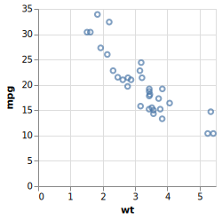
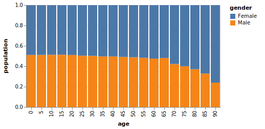

<!-- README.md is generated from README.Rmd. Please edit that file -->

<!-- badges: start -->


[](https://travis-ci.org/vegawidget/vlbuildr)
<!-- badges: end -->

# vlbuildr

The goal of vlbuildr is to provide an R api for building up vega-lite
specs.

### Current status

This package is in early stages at the moment. Most of a “v0” of the
public facing API has been built (although definitely not locked-down
yet\!).

However, the internals of the package might change substantially to
provide greater robustness, make it harder to make invalid specs, and/or
provide more info when making invalid spec. The current approach seeks
to make it easy to build up specs, provided your input arguments are
okay… but it does no checking of those inputs and you can very easily
make invalid specs\! Still TBD exactly how rigorous/helpful this package
will aim to be with regards to bad specifications..

The documentation is also still very bare-bones. The parameter
documentation for functions is fairly complete, however, as it relies on
descriptions pulled directly from the Vega-Lite schema.

## Inspiration and related work

The API for this package is heavily inspired by the [vegalite R
package](articles/examples.html), but is rebuilt from scratch to (1)
build up the API semi-automatically based on the Vega-lite schema (an
approach inspired by [Altair](https://github.com/altair-viz/altair) and
[vega-lite-api](https://github.com/vega/vega-lite-api)) and (2) take
advantage of the htmlwidget infrastucture for vega specs provided by the
[vegawidget]() package.

## Building

Much of the public API is auto-generated via the `build.R` script in the
`inst` directory. The script makes uses of another package,
[vlmetabuildr](https://github.com/AliciaSchep/vlmetabuildr).

## Examples

These are some examples showing current capabilities; see [pkgdown
site](https://vegawidget.github.io/vlbuildr/articles/examples.html) for
more examples, including interactive ones.

``` r
library(vlbuildr)
vl_chart() %>%
   vl_add_data(values = mtcars) %>%
   vl_mark_point() %>%
   vl_encode_x("wt") %>%
   vl_encode_y("mpg") 
```

<!-- -->

``` r
vl_chart() %>%
  vl_add_data(url = "https://vega.github.io/vega-editor/app/data/population.json") %>%
  vl_calculate(calculate = "datum.sex == 2 ? 'Female' : 'Male'", 
               as = "gender") %>%
  vl_filter("datum.year == 2000") %>%
  vl_encode(x = "age:O", y = "people:Q", color = "gender:N") %>%
  vl_scale_x(rangeStep = 17) %>%
  vl_stack_y("normalize") %>%
  vl_aggregate_y("sum") %>%
  vl_axis_y(title = "population") %>%
  vl_mark_bar() 
```

<!-- -->
